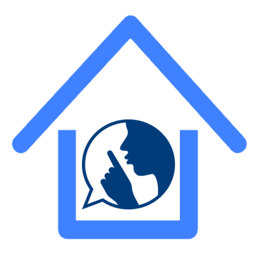
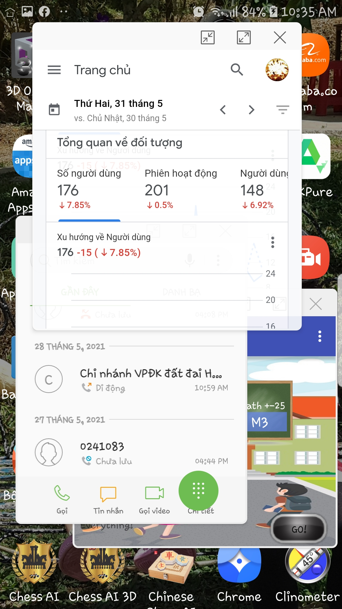

# Stability and Faster Launcher *(Lanceur Stability and Stabilité et plus rapide )*

Stability and Faster Launcher provides you a distraction ✋free and clear home screen. Everything accessible with one hand and lets you focus on what matters.
Using your finger to slide down for display your favorites applications or up to see the complete list of applications.
If you hold your finger a few moments on an application, you will be offered to access its system settings.

{width="80" height="80"}

**Available on [F-Droid](https://f-droid.org/en/packages/com.tglt.launcher.discreet) and [Google Play](https://play.google.com/store/apps/details?id=com.tglt.launcher.discreet)**
*(disponible sur [F-Droid](https://f-droid.org/fr/packages/com.tglt.launcher.discreet) et [Google Play](https://play.google.com/store/apps/details?id=com.tglt.launcher.discreet))*

  
Please note that the F-Droid build and publishing process is automatic and usually take 4 to 8 days to complete.
You may see a gap between the latest release and what is really available on F-Droid.  
*(Le processus de compilation et de publication par F-Droid est automatique et prend généralement 4 à 8 jours.
Il y a donc parfois une différence entre la dernière version et ce qui est disponible sur F-Droid.)*

## Screenshots *(Captures d'écran)*

## ⚡ Features
🔹 Favorites applications
🔹 Quickbar applications
🔹 Folders
🔹 Hide applications
🔹 Notification for favorites access
🔹 Web applications support
🔹 Export/import settings
🔹 Help and changelog
🔹 Freeform multiple window mode
🔹 Changer icon site

## 🏆 Customization options
🔹 Force portrait mode
🔹 Immersive mode
🔹 Reversed interface
🔹 Clock on the home screen
🔹 Transparent status bar
🔹 Hide applications names
🔹 Icon packs support

## Update from
[Discreet Launcher](https://github.com/falzonv/discreet-launcher)
Thank you Vincent FALZON