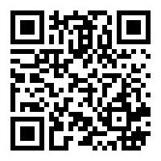

# Stability and Faster Launcher *(Lanceur Stability and Stabilité et plus rapide )*

Stability and Faster Launcher provides you a distraction ✋free and clear home screen. Everything accessible with one hand and lets you focus on what matters.
Using your finger to slide down for display your favorites applications or up to see the complete list of applications.
If you hold your finger a few moments on an application, you will be offered to access its system settings.

**Available on [Galaxy Store](http://galaxystore.samsung.com/detail/com.tglt.launcher.discreet) and [Google Play](https://play.google.com/store/apps/details?id=com.tglt.launcher.discreet)**
*(disponible sur [Galaxy Store](http://galaxystore.samsung.com/detail/com.tglt.launcher.discreet) et [Google Play](https://play.google.com/store/apps/details?id=com.tglt.launcher.discreet))*

  

## Screenshots *(Captures d'écran)*

## ⚡ Features
🔹 Favorites applications
🔹 Quickbar applications
🔹 Folders
🔹 Hide applications
🔹 Notification for favorites access
🔹 Web applications support
🔹 Export/import settings
🔹 Help and changelog
🔹 Freeform multiple window mode
🔹 Changer icon site

## 🏆 Customization options
🔹 Force portrait mode
🔹 Immersive mode
🔹 Reversed interface
🔹 Clock on the home screen
🔹 Transparent status bar
🔹 Hide applications names
🔹 Icon packs support

## Update from
[Discreet Launcher](https://github.com/falzonv/discreet-launcher)
Thank you Vincent FALZON

## Donate
If you like Stability and Faster Launcher be happy about a donation. You can either send bitcoin or donate via Paypal.

<table>
  <tr>
    <td></td>
    <td></td>
    <td><samp>bc1q8z8ec9m29revsvpe9wtyvnlnave3jjz8w47snd</samp></td>
  </tr>
  <tr>
    <td></td>
    <td></td>
    <td></td>
  </tr>
</table>

Thank you!